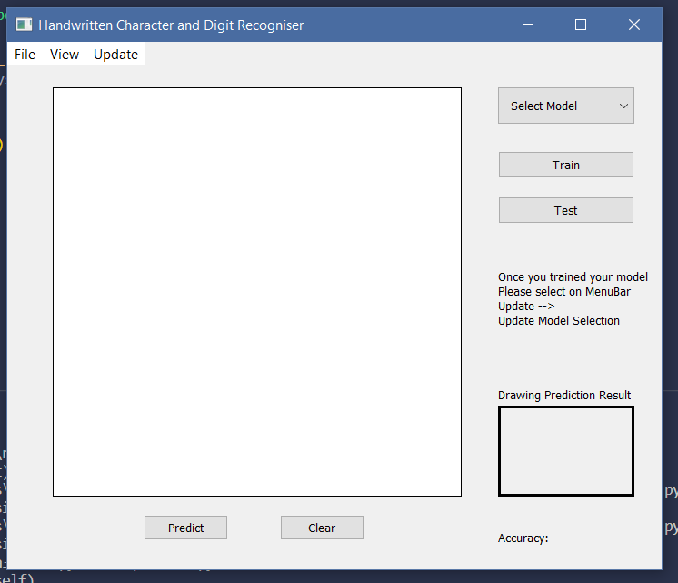

# Handwritten Character and Digit Recogniser
Authors: Team 10 - Shou Miyamoto and Rachel Nataatmadja

This is a tool that recognises handwritten digits and English letters using LeNet5 and SpinalNet as Neural Network models and EMNIST dataset. The project is to design and implement a user interface and its back-end where users can carry out the machine learning tasks with the dataset.

# Instructions for Install and Run
1. Use a device with windows operating system. This because we have based the GUI on windows operating systems and have been using the windows operating system to program this.
2. Download and install miniconda from https://docs.conda.io/en/latest/miniconda.html and select the python 3.8 windows version.
3. Open up the Anaconda prompt and copy this command `conda create –n py38 python=3.8` and paste it in the prompt. Press and enter y when prompted.
4. Once environment has been created write this command `conda activate py38` on the prompt to activate the py38 environment. Your environment will change from (base) to (py38)
5. Install scikit-image library by writing `pip install scikit-image` on the command line. Press and enter y if prompted to.
6. Install PyQt5, torch and torchvision libraries by writing `pip install PyQt5 torch torchvision` on command line. Press and enter y if prompted to.
**Note it is important that you install the scikit-image library before PyQt5, torch and torchvision.**
7. Download and install Visual Studio Code from https://code.visualstudio.com/download and open Visual Studio Code when finished downloading.
8. On Visual Studio Code, install the Python package in the extension market place (the last button on the left-most vertical side bar)
9. Download or clone this project from Github
10. Go to `project1-team_10 --> software --> main.py` to run the code. In Visual Studio Code, make sure to select `software` folder as workspace in order for class imports to work.

# How to use

Run main.py
- To download EMNIST dataset, go on the toolbar and click on "File" and then "Import" which will open up a new window
  - Press the "Start" button to start downloading or "Cancel" to restart the download
  - "Start" button will be disabled during download process and a "Finish" button will appear when the download has finished
 **Note: make sure you have downloaded the EMNIST dataset before using any other features**

- To view train or test images go on the toolbar and click on "View" and then "View Train" or "View Test" depending on which one you want to see.
  - By default characters and digit images are shown
  - To only see character images, select the "Character" radio button
  - To only see a specific character image (eg: only A's), write the character on the textbox next to the "Character" title
  - To only see digit images, select the "Digit" radio button 
  - To only see a specific digit (eg: only 5's), write the digit on the textbox next to the "Digit" title
  - To show all images again, select the all radio button

- To train a model, select a model from the "Select Model" drop down in the main menu (either LeNet5 or SpinalNet) and press the "Train" button
  - Drag the slider to choose the train ratio and enter the hyperparamaters such as batch size, epoch number and a name that you want the model to be saved as in the textboxes provided
  - Press the "Train" button once you have configured those paramaters or press "Cancel" to exit
  - Once you have pressed the "Train" button, a window for the training progress will pop up
    - Press "Start" to begin training or "Cancel" to exit. You may press "Cancel" at any time during the training process which will cancel the training
    - Once training has finished, make sure to go on the toolbar on the main window and click on "Update" and then "Update Model Selection". This will allow you to see your trained model on the "Select Model" drop down. **Make sure you do this step before pressing the "Test" button or "Predict" button on the main window**

**Note: Before pressing the "Test" button or "Predict" button in the main window, make sure you have trained a model and selected it in the "Select Model" drop down**
- To choose images for testing, select your trained model from the drop down and press the "Test" button on the main menu
  - To select all images, press the "Select All" radio button
  - To be able to choose images, press the "Custom Choose" radio button and write the co-ordinates into the text box. The format is `row<space>column` where the row is       0-x and column is 0-3.
  - Selected images will be highlighted in red
  - To deselect images, press the "Cancel" button
  - Press the "Test" button to proceed to predictions which will open up a window of predicted results
    - On the window of predicted results, press the "Start" button to begin predicting or "Exit" to close the window
    - Once prediction has finished, hover over the images to view the predicted result

- To predict a drawn image, select your trained model from the drop down and draw the character or digit on the canvas above the "Predict" and "Clear" button
  - To clear the canvas, press the "Clear" button
  - To predict your drawing, press the "Predict" button
  

# Versions
Version as of 2/5/22
- User can use a saved trained model and select certain test images for prediction
- User can use a saved trained model and draw a character or digit on the canvas and send for prediction

Version as of 1/5/22
- Users can train the model of their choosing (ie: either LeNet5 or SpinalNet) and configure hyperparameters 
- Users can see the training progress
- Users can manually update the select model comobo box once training has been completed using Update --> Update Model Selection on the tool bar
- Users can select images on the GUI
- Users can cancel the training progress
- Users can stop the downloading dataset progress

Version as of 30/4/22
- Users now have a choice of SpinalNet or LeNet5 models instead of VGG and AlexNet

Version as of 29/4/22
- Basic GUI for selecting test images for prediction was made
- Users can draw on the canvas

Version as of 28/4/22
- Users can see the total number of images displayed when viewing train or test images
- Users can now view train or test images and filter them by character, digits or a specfic character or digit (up to 10k images)

Version as of 26/4/22
- Users can filter for only characters, only digits or specific character or digits when viewing images

Version as of 24/4/22
- Images no longer are being downloaded as pngs to display on the image viewing feature because it takes too long. Pixelmaps are now used instead

Version as of 22/4/22
- Images are downloaded as pngs to be displayed on image viewer
- Basic GUI of image viewer was made

Version as of 20/4/22
- mainmenu basic implementation started
- Train set basic GUI view design complete (no connections made)

Version as of 17/4/22
-skeleton code of mainmenu and dataset

Version as of 15/4/22
-planning and project doc added.

# References
- LeNet5 Model: https://github.com/lychengr3x/LeNet-5-Implementation-Using-Pytorch/blob/master/LeNet-5%20Implementation%20Using%20Pytorch.ipynb
- SpinalNet Model: https://github.com/dipuk0506/SpinalNet/blob/master/MNIST/SpinalNet_EMNIST_Digits.py
- EMNIST: https://www.nist.gov/itl/products-and-services/emnist-dataset
